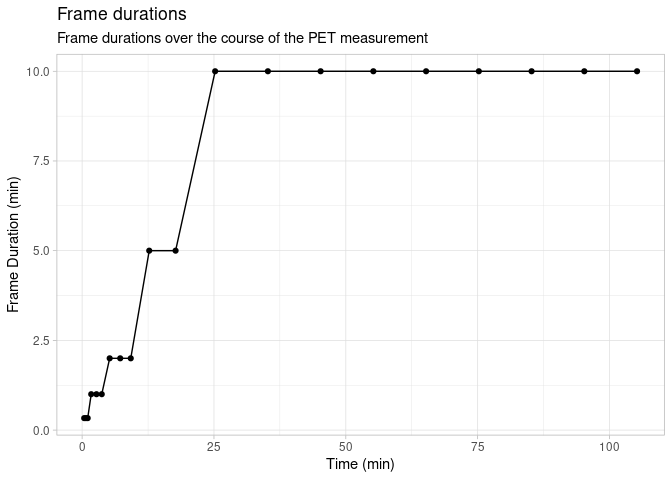
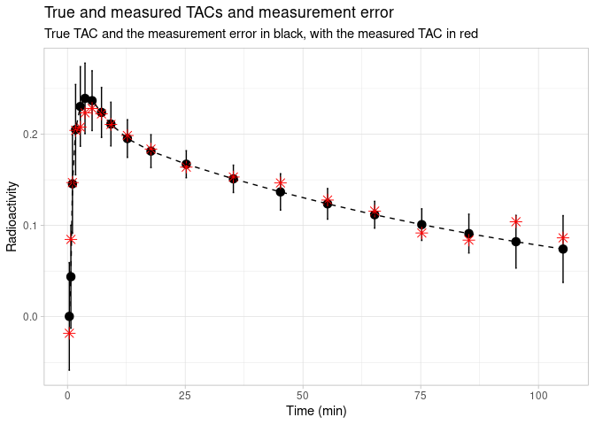
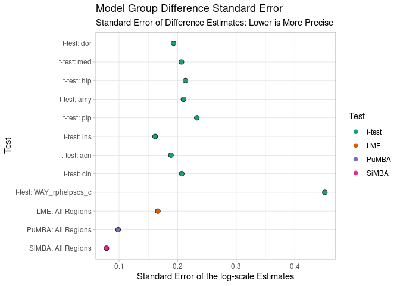

PuMBA Demonstration
================

-   [Aims](#aims)
-   [Libraries](#libraries)
-   [TAC Data: 2TC](#tac-data-2tc)
    -   [Exploring the data](#exploring-the-data)
        -   [Loading](#loading)
        -   [Measured Data](#measured-data)
        -   [Simulation Data](#simulation-data)
    -   [NLS Modelling](#nls-modelling)
        -   [Comparison to true values](#comparison-to-true-values)
    -   [Conventional Statistical
        Analysis](#conventional-statistical-analysis)
        -   [t-tests](#t-tests)
        -   [LME](#lme)
    -   [PuMBA](#pumba)
    -   [Comparison of estimates](#comparison-of-estimates)
-   [Other Models](#other-models)
    -   [SRTM: \[11C\]DASB](#srtm-11cdasb)
    -   [1TC: \[11C\]GR103545](#1tc-11cgr103545)

# Aims

Here I will show the basic usage of PuMBA on a couple of simulated
datasets. I will first go through the data briefly, and then demonstrate
fitting the model to this data.

# Libraries

``` r
library(tidyverse)
library(brms)
library(skimr)
library(ggbeeswarm)
library(job)
library(broom)
library(broom.mixed)
library(lme4)
library(lmerTest)

theme_set(theme_light())
set.seed(555)
```

# TAC Data: 2TC

I will first demonstrate the use of PuMBA using a simulated dataset
taken from our first paper on these types of models, called SiMBA. The
dataset comes from [here](https://github.com/mathesong/SiMBA_Materials).

## Exploring the data

### Loading

I saved the simulated sample data in the RawData folder.

``` r
simdat <- readRDS("../RawData/simdata.rds")

head(simdat)
```

    ## # A tibble: 6 × 31
    ##       n Regions Difference sigma Region logK1_true logBPnd_true logVnd_true logk4_true logvB_true sigma_true inpshift_mod     A     B      C alpha  beta  gamma peaktime peakval    t0 slope t_tac durations meanblood sigwig     TAC
    ##   <dbl> <chr>        <dbl> <chr> <chr>       <dbl>        <dbl>       <dbl>      <dbl>      <dbl>      <dbl>        <dbl> <dbl> <dbl>  <dbl> <dbl> <dbl>  <dbl>    <dbl>   <dbl> <dbl> <dbl> <dbl>     <dbl>     <dbl>  <dbl>   <dbl>
    ## 1    10 all          0.182 10%   dor         -2.15         2.04      -0.823      -3.67      -3.52      -3.39       0.0112  182.  1.35 0.0378  4.90 0.367 0.0242     1.18    3.61 0.325  4.23 0.167     0.333     0      0.798 -0.0262
    ## 2    10 all          0.182 10%   dor         -2.15         2.04      -0.823      -3.67      -3.52      -3.39       0.0112  182.  1.35 0.0378  4.90 0.367 0.0242     1.18    3.61 0.325  4.23 0.5       0.333     0.631  0.754  0.0285
    ## 3    10 all          0.182 10%   dor         -2.15         2.04      -0.823      -3.67      -3.52      -3.39       0.0112  182.  1.35 0.0378  4.90 0.367 0.0242     1.18    3.61 0.325  4.23 0.833     0.333     2.69   0.710  0.141 
    ## 4    10 all          0.182 10%   dor         -2.15         2.04      -0.823      -3.67      -3.52      -3.39       0.0112  182.  1.35 0.0378  4.90 0.367 0.0242     1.18    3.61 0.325  4.23 1.5       1         2.02   0.623  0.419 
    ## 5    10 all          0.182 10%   dor         -2.15         2.04      -0.823      -3.67      -3.52      -3.39       0.0112  182.  1.35 0.0378  4.90 0.367 0.0242     1.18    3.61 0.325  4.23 2.5       1         0.937  0.495  0.306 
    ## 6    10 all          0.182 10%   dor         -2.15         2.04      -0.823      -3.67      -3.52      -3.39       0.0112  182.  1.35 0.0378  4.90 0.367 0.0242     1.18    3.61 0.325  4.23 3.5       1         0.913  0.373  0.318 
    ## # … with 4 more variables: sigma_w_true <dbl>, TAC_true <dbl>, WAYID <int>, Group <chr>

``` r
skim(simdat)
```

|                                                  |        |
|:-------------------------------------------------|:-------|
| Name                                             | simdat |
| Number of rows                                   | 3600   |
| Number of columns                                | 31     |
| \_\_\_\_\_\_\_\_\_\_\_\_\_\_\_\_\_\_\_\_\_\_\_   |        |
| Column type frequency:                           |        |
| character                                        | 4      |
| numeric                                          | 27     |
| \_\_\_\_\_\_\_\_\_\_\_\_\_\_\_\_\_\_\_\_\_\_\_\_ |        |
| Group variables                                  | None   |

Data summary

**Variable type: character**

| skim\_variable | n\_missing | complete\_rate | min | max | empty | n\_unique | whitespace |
|:---------------|-----------:|---------------:|----:|----:|------:|----------:|-----------:|
| Regions        |          0 |              1 |   3 |   3 |     0 |         1 |          0 |
| sigma          |          0 |              1 |   3 |   3 |     0 |         1 |          0 |
| Region         |          0 |              1 |   3 |  15 |     0 |         9 |          0 |
| Group          |          0 |              1 |   7 |   7 |     0 |         2 |          0 |

**Variable type: numeric**

| skim\_variable | n\_missing | complete\_rate |  mean |    sd |    p0 |   p25 |   p50 |   p75 |   p100 | hist  |
|:---------------|-----------:|---------------:|------:|------:|------:|------:|------:|------:|-------:|:------|
| n              |          0 |              1 | 10.00 |  0.00 | 10.00 | 10.00 | 10.00 | 10.00 |  10.00 | ▁▁▇▁▁ |
| Difference     |          0 |              1 |  0.18 |  0.00 |  0.18 |  0.18 |  0.18 |  0.18 |   0.18 | ▁▁▇▁▁ |
| logK1\_true    |          0 |              1 | -2.47 |  0.30 | -3.35 | -2.70 | -2.45 | -2.25 |  -1.88 | ▁▃▆▇▃ |
| logBPnd\_true  |          0 |              1 |  1.99 |  0.39 |  1.26 |  1.64 |  2.00 |  2.27 |   2.97 | ▆▆▇▅▁ |
| logVnd\_true   |          0 |              1 | -0.59 |  0.44 | -1.71 | -0.80 | -0.59 | -0.29 |   0.40 | ▂▂▇▆▂ |
| logk4\_true    |          0 |              1 | -3.82 |  0.20 | -4.46 | -3.96 | -3.77 | -3.67 |  -3.34 | ▁▃▅▇▁ |
| logvB\_true    |          0 |              1 | -3.81 |  0.71 | -5.56 | -4.29 | -3.78 | -3.46 |  -2.10 | ▁▅▇▃▂ |
| sigma\_true    |          0 |              1 | -4.23 |  0.57 | -5.53 | -4.62 | -4.26 | -3.85 |  -2.40 | ▂▇▇▂▁ |
| inpshift\_mod  |          0 |              1 | -0.09 |  0.13 | -0.24 | -0.18 | -0.10 | -0.07 |   0.35 | ▇▇▂▁▁ |
| A              |          0 |              1 | 27.66 | 40.29 |  0.19 |  4.23 | 13.44 | 29.03 | 181.70 | ▇▂▁▁▁ |
| B              |          0 |              1 |  1.08 |  0.44 |  0.30 |  0.73 |  1.14 |  1.32 |   1.92 | ▆▆▇▆▅ |
| C              |          0 |              1 |  0.04 |  0.02 |  0.01 |  0.02 |  0.03 |  0.05 |   0.07 | ▇▅▁▃▆ |
| alpha          |          0 |              1 |  2.80 |  1.19 |  0.49 |  2.10 |  3.06 |  3.42 |   4.90 | ▆▃▇▇▆ |
| beta           |          0 |              1 |  0.48 |  0.14 |  0.17 |  0.39 |  0.50 |  0.58 |   0.72 | ▂▃▇▇▅ |
| gamma          |          0 |              1 |  0.03 |  0.01 |  0.02 |  0.02 |  0.04 |  0.04 |   0.04 | ▆▁▂▆▇ |
| peaktime       |          0 |              1 |  1.06 |  0.18 |  0.82 |  0.94 |  1.06 |  1.13 |   1.57 | ▆▇▃▁▁ |
| peakval        |          0 |              1 |  2.53 |  0.95 |  0.80 |  1.92 |  2.27 |  3.26 |   4.58 | ▃▇▅▆▁ |
| t0             |          0 |              1 |  0.34 |  0.15 |  0.05 |  0.27 |  0.33 |  0.44 |   0.76 | ▅▅▇▁▁ |
| slope          |          0 |              1 |  3.89 |  1.78 |  0.85 |  2.74 |  3.69 |  5.22 |   7.93 | ▅▇▅▇▁ |
| t\_tac         |          0 |              1 | 32.36 | 34.55 |  0.17 |  3.31 | 15.12 | 57.68 | 105.24 | ▇▂▂▂▂ |
| durations      |          0 |              1 |  5.50 |  4.25 |  0.33 |  1.00 |  5.00 | 10.00 |  10.00 | ▇▁▂▁▇ |
| meanblood      |          0 |              1 |  0.41 |  0.58 |  0.00 |  0.05 |  0.18 |  0.55 |   4.32 | ▇▁▁▁▁ |
| sigwig         |          0 |              1 |  0.00 |  0.47 | -0.62 | -0.42 | -0.06 |  0.40 |   0.80 | ▇▅▃▃▅ |
| TAC            |          0 |              1 |  0.13 |  0.09 | -0.29 |  0.07 |  0.12 |  0.19 |   0.58 | ▁▂▇▂▁ |
| sigma\_w\_true |          0 |              1 | -4.23 |  0.74 | -6.15 | -4.76 | -4.26 | -3.72 |  -1.61 | ▂▇▇▃▁ |
| TAC\_true      |          0 |              1 |  0.13 |  0.09 |  0.00 |  0.07 |  0.12 |  0.18 |   0.59 | ▇▆▂▁▁ |
| WAYID          |          0 |              1 | 10.50 |  5.77 |  1.00 |  5.75 | 10.50 | 15.25 |  20.00 | ▇▇▇▇▇ |

### Measured Data

This dataset consists of 10 controls and 10 patients. The sigma value is
set to about 10% of the mean TAC value. There is a group difference of
20% (Cohen’s d = 0.55) in all regions. The unique identifier for each
individual is called `WAYID`.

#### TAC

For now, I’ll just work with the first subject and one region.

``` r
subjdat <- simdat %>% 
  filter(WAYID==WAYID[sample(1:nrow(simdat), 1)] & Region=="dor")
```

Let’s have a look

``` r
subjdat %>% 
  select(t_tac, Measured = TAC, True = TAC_true) %>% 
  ggplot(aes(x=t_tac, y=Measured)) +
  geom_point() + 
  geom_line(aes(y=True), linetype="dashed") +
  labs(title="Simulated TAC from the DLPFC",
       subtitle="Points represent the measured TAC, and the dashed line represents the true TAC without error",
       x = "Time (min)",
       y = "Radioactivity")
```

<!-- -->

#### Arterial Input function

The AIF is modelled with a tri-exponential function.

``` r
predict_aif <- function(time, t0, slope, peaktime, A, B, C, alpha, beta, gamma) {
  
  t_corr <- time - t0
  
  if(t_corr <= 0) {
    pred <- 0
    return(pred)
  }
  
  if(t_corr <= peaktime) {
    pred <- t_corr * slope
    return(pred)
  }
  
  if(t_corr > peaktime) {
    pred <- A*exp(-alpha*t_corr) + 
      B*exp(-beta*t_corr) + 
      C*exp(-gamma*t_corr)
    return(pred)
  }
}

time <- seq(0, 105, by=0.01)
aif <- map_dbl(time, ~with(subjdat[1,], 
            predict_aif(.x, t0, slope, peaktime, A, B, C, alpha, beta, gamma)))

AIFdat <- tibble(
  time = time, 
  AIF = aif
)

ggplot(AIFdat, aes(x=time, y=AIF)) +
  geom_line(colour="red")
```

<!-- -->

So now, we can show the AIF and the TAC together.

``` r
subjdat %>% 
  select(t_tac, Measured = TAC, True = TAC_true) %>% 
  ggplot(aes(x=t_tac, y=Measured)) +
  geom_point() + 
  geom_line(aes(y=True), linetype="dashed") +
  labs(title="Simulated TAC and AIF",
       subtitle="Black represents the TAC and true TAC, while red represents the AIF",
       x = "Time (min)",
       y = "Radioactivity") +
  geom_line(data = AIFdat, aes(x=time, y=AIF), colour="red") +
  coord_cartesian(ylim = c(-0.02, 0.3))
```

<!-- -->

#### Whole Blood

We did not have access to whole blood data, as this was not measured.
However, we did measure whole plasma data, which we substitute for whole
blood data. In preprocessing, I fit a spline to this data, and
calculated the mean blood concentration during each frame. This allows
us to input blood concentration as a vector like the TAC.

``` r
ggplot(subjdat, aes(x=t_tac, y=TAC)) +
  geom_point() + 
  geom_line(aes(x=t_tac, y=meanblood), colour="blue") +
  geom_point(aes(x=t_tac, y=meanblood), colour="blue") +
  geom_line(data = AIFdat, aes(x=time, y=AIF), colour="red") +
  labs(title="Blood, AIF and TAC",
       subtitle="The whole blood is represented in blue, the AIF in red, and the TAC in black",
       x = "Time (min)",
       y = "Radioactivity")
```

<!-- -->

### Simulation Data

Now, let’s explore some of the characteristics of the simulation.

#### Measurement Error

First, let’s look at measurement error. This is simulated from the
fitted spline. Let’s examine the values of the measurement error SD over
the course of the single TAC above.

``` r
subjdat %>% 
  mutate(Sigma_Percentage = 100*(exp(sigwig))) %>% 
  ggplot(aes(x=t_tac, y=Sigma_Percentage)) +
  geom_point() +
  geom_line() +
  geom_hline(aes(yintercept=100), linetype="dashed") +
  labs(x="Time (min)",
       y="Measurement Error (%)",
       title="Measurement error function",
       subtitle="Measurement error as a percentage of the mean value across the PET measurement")
```

<!-- -->

This function is partially related to the durations of the frames, but
not completely.

``` r
ggplot(data=subjdat, aes(x=t_tac, y=durations)) +
  geom_point() +
  geom_line() +
  labs(x="Time (min)",
       y="Frame Duration (min)",
       title="Frame durations",
       subtitle="Frame durations over the course of the PET measurement")
```

<!-- -->

The true sigma at each point in time is taken from the addition of the
true sigma for each ROI and individual, `sigma_true`, and adding
`sigwig` (the sigma wiggly function), to make `sigma_w_true`.

Let’s show this represented around the TAC.

``` r
subjdat %>% 
  select(t_tac, Measured = TAC, True = TAC_true, sigma = sigma_w_true) %>% 
  mutate(sigma = exp(sigma)) %>% 
  ggplot(aes(x=t_tac, y=Measured)) +
  geom_point(size=3, aes(y=True)) + 
  geom_errorbar(aes(ymax = True + 1.96*sigma, ymin = True - 1.96*sigma)) +
  geom_point(colour="red", size=3, shape=8) + 
  geom_line(aes(y=True), linetype="dashed") +
  labs(title="True and measured TACs and measurement error",
       subtitle="True TAC and the measurement error in black, with the measured TAC in red",
       x = "Time (min)",
       y = "Radioactivity")
```

<!-- -->

#### Parameters by Region

The true parameters are included as simulated from the model. Here I’ll
make a data frame with only the parameters.

``` r
pardat <- simdat %>% 
  filter(!duplicated(paste0(WAYID, Region))) %>% 
  select(WAYID, Region, contains("_true"), Group) %>% 
  select(-TAC_true, -sigma_w_true) %>% 
  gather(Parameter, Value, -WAYID, -Region, -Group) %>% 
  mutate(Value = exp(Value),
         Parameter = str_remove(Parameter, "log"),
         Parameter = str_remove(Parameter, "_true"),
         Parameter = fct_inorder(Parameter))

pardat_wide <- simdat %>% 
  filter(!duplicated(paste0(WAYID, Region))) %>% 
  select(WAYID, Region, contains("_true"), Group) %>% 
  select(-TAC_true, -sigma_w_true)
```

Let’s look at the differences between true parameters in the different
regions.

``` r
ggplot(pardat, aes(x=Value, colour=Region, fill=Region)) + 
  geom_histogram(alpha=0.4) +
  facet_grid(Region ~ Parameter, scales="free") +
  theme(axis.text.x = element_text(angle = 45, vjust = 0.5, hjust=1))
```

    ## `stat_bin()` using `bins = 30`. Pick better value with `binwidth`.

<!-- -->

Note the regions are as follows:

-   acn : anterior cingulate cortex
-   amy : amygdala
-   cin : posterior cingulate cortex
-   dor : dorsolateral prefrontal cortex
-   hip : hippocampus
-   ins : insula
-   med : medial prefrontal cortex
-   pip : parahippocampal cortex
-   WAY\_rphelpscs\_c : dorsal raphe nucleus

#### Parameters by Group

There are only group differences in BP<sub>ND</sub>, which are the same
across all regions: 20%. Let’s take a look by looking at only the DLPFC
ROI.

``` r
parroidat <- pardat %>% 
  filter(Region=="dor")
```

Let’s look at the differences between true parameters in the different
regions.

``` r
ggplot(parroidat, aes(x=Group, y=Value, colour=Group, fill=Group)) + 
  geom_violin(alpha=0.4) +
  geom_beeswarm() +
  facet_wrap(~Parameter, scales="free")
```

<!-- -->

This really speaks to the difficulty of sampling variation… Really hard
to see anything at all there in BP<sub>ND</sub> in this particular
sample.

## NLS Modelling

We would usually model these TACs using nonlinear least squares, and
then perform statistical inference. Let’s do that for comparison here.
First, we need to define the model in R code.

``` r
two_compartment_log = function(logk1, logvnd, logbpnd, logk4, logvb, time, 
                               t0_aif, b_aif, 
                               lambda1_aif, lambda2_aif, lambda3_aif, 
                               A1_aif, A2_aif, A3_aif, tstar_aif, 
                               bloodval){
  
  
  k1 = exp(logk1)
  vnd = exp(logvnd)
  bpnd = exp(logbpnd)
  k4 = exp(logk4)
  vb = exp(logvb)
  
  k2 = k1 / vnd
  k3 = bpnd * k4
  
  R1 = 0.5 * (k2 + k3 + k4 + sqrt((k2 + k3 + k4)^2 - 4 * k2 * k4))
  R2 = 0.5 * (k2 + k3 + k4 - sqrt((k2 + k3 + k4)^2 - 4 * k2 * k4))
  L1 = (k1 * (R1 - k3 - k4))/(R1 - R2)
  L2 = (k1 * (k3 + k4 - R2))/(R1 - R2)
  
  time <- time - t0_aif
  tstar_aif <- tstar_aif - t0_aif
  
  out <- (time>0)*((1-vb)*
                     
   ((time<tstar_aif)*(b_aif*L1*(exp(-R1*time)/R1^2 + time/R1 - 1/R1^2) +
                        b_aif*L2*(exp(-R2*time)/R2^2 + time/R2 - 1/R2^2)) +
      
      (time>=tstar_aif)*(b_aif*L1*exp(-R1*time)*(tstar_aif/R1*exp(R1*tstar_aif) - 
                                                   1/R1^2*exp(R1*tstar_aif) + 
                                                   1/R1^2) + 
         L1*A1_aif*(exp(-lambda1_aif*time)/(R1-lambda1_aif) -
                      exp(R1*tstar_aif-R1*time-lambda1_aif*tstar_aif)/(R1-lambda1_aif)) +
         L1*A2_aif*(exp(-lambda2_aif*time)/(R1-lambda2_aif) -
                      exp(R1*tstar_aif-R1*time-lambda2_aif*tstar_aif)/(R1-lambda2_aif)) +
         L1*A3_aif*(exp(-lambda3_aif*time)/(R1-lambda3_aif) -
                      exp(R1*tstar_aif-R1*time-lambda3_aif*tstar_aif)/(R1-lambda3_aif)) +
         b_aif*L2*exp(-R2*time)*(tstar_aif/R2*exp(R2*tstar_aif) - 
                                   1/R2^2*exp(R2*tstar_aif) + 1/R2^2) +
         L2*A1_aif*(exp(-lambda1_aif*time)/(R2-lambda1_aif) -
                      exp(R2*tstar_aif-R2*time-lambda1_aif*tstar_aif)/(R2-lambda1_aif)) +
         L2*A2_aif*(exp(-lambda2_aif*time)/(R2-lambda2_aif) -
                      exp(R2*tstar_aif-R2*time-lambda2_aif*tstar_aif)/(R2-lambda2_aif)) +
         L2*A3_aif*(exp(-lambda3_aif*time)/(R2-lambda3_aif) -
                      exp(R2*tstar_aif-R2*time-lambda3_aif*tstar_aif)/(R2-lambda3_aif)))) + 
                     vb*bloodval)
  
  out <- as.numeric(out)
  
  return(out)
}
```

Now, we calculate model weights.

``` r
nls_simdat_wide <- simdat %>% 
    pivot_wider(names_from = Region, values_from = TAC, id_cols = c(WAYID, t_tac, durations)) %>% 
    group_by(WAYID) %>% 
    nest() %>% 
    mutate(weights = map(data, ~kinfitr::weights_create(
      t_start = .x$t_tac - 0.5*.x$durations,
      t_end   = .x$t_tac + 0.5*.x$durations,
      tac = abs(.x$dor), radioisotope = "C11"
    ))) %>% 
    unnest(c(data, weights)) %>% 
    pivot_longer(cols = dor:WAY_rphelpscs_c, names_to = "Region", values_to = "TAC") %>% 
    ungroup()
```

… and then bind them to the data

``` r
nls_simdat <- left_join(nls_simdat_wide, simdat, by=c("WAYID", "t_tac", 
                                                    "durations", "Region", 
                                                    "TAC")) %>% 
    group_by(WAYID, Region) %>% 
    nest() %>% 
    mutate(weightsvals = map(data, ~pull(.x, weights)))
```

Now we’re ready to fit the TACs. I fit them with multiple starting
values (10 fits per TAC), to try to avoid falling into a local minimum.

``` r
nls_simdat <- nls_simdat %>%
  mutate(fit = map(data, ~nls.multstart::nls_multstart(
    TAC ~ two_compartment_log(logk1, logvnd, logbpnd, logk4, logvb,
                              t_tac, t0, slope,
                              alpha, beta, gamma,
                              A, B, C, peaktime,
                              meanblood), data = .x,
    start_lower = c(logk1=-3, logvnd=-1.5, logbpnd=1.5, logk4=-4.5, logvb=-4.5),
    start_upper = c(logk1=-2, logvnd=-0.5, logbpnd=2.5, logk4=-3.5, logvb=-3.5),
    upper = c(logk1=0, logvnd=1, logbpnd=3.5, logk4=-1, logvb=-2.5),
    lower = c(logk1=-6, logvnd=-4, logbpnd=-1, logk4=-4, logvb=-7),
    modelweights = weights, iter=10, supp_errors = "Y")))
```

Now, let’s extract the values

``` r
nls_simres <- nls_simdat %>% 
    mutate(coef = map(fit, ~as.data.frame(as.list(coef(.x))))) %>% 
    ungroup() %>% 
    unnest(coef) %>% 
    mutate(logvt = log( exp(logvnd)*(1 + exp(logbpnd)) ),
           logbpp = log( exp(logvnd)*(exp(logbpnd)) ),
           Group = map_chr(data, ~.x$Group[1])) %>% 
    select(WAYID, Region, logk1:Group)
  
truevals <- nls_simdat %>% 
    select(WAYID, Region, data) %>% 
    unnest(data) %>% 
    filter(!duplicated(paste0(Region, WAYID))) %>% 
    select(WAYID, Region, ends_with("_true")) %>% 
    select(-TAC_true) %>% 
    mutate(logVt_true = log( exp(logVnd_true)*(1 + exp(logBPnd_true)) ),
           logBPp_true = log( exp(logVnd_true)*(exp(logBPnd_true))) )
  
nls_simres <- nls_simres %>% 
    left_join(truevals)
```

    ## Joining, by = c("WAYID", "Region")

### Comparison to true values

Let’s see how well we’ve estimated the binding.

First, for BP<sub>P</sub>:

``` r
ggplot(nls_simres, aes(x=logBPp_true, y=logbpp, colour=Region)) + 
  geom_point() +
  facet_wrap(~Region, scales="free") + 
  geom_smooth(method="lm", se=FALSE)
```

    ## `geom_smooth()` using formula 'y ~ x'

<!-- -->

``` r
nls_simres %>% 
  group_by(Region) %>% 
  summarise(cor = cor(logBPp_true, logbpp))
```

    ## # A tibble: 9 × 2
    ##   Region            cor
    ##   <chr>           <dbl>
    ## 1 acn             0.895
    ## 2 amy             0.884
    ## 3 cin             0.912
    ## 4 dor             0.955
    ## 5 hip             0.864
    ## 6 ins             0.951
    ## 7 med             0.969
    ## 8 pip             0.912
    ## 9 WAY_rphelpscs_c 0.316

And then for BP<sub>ND</sub>:

``` r
ggplot(nls_simres, aes(x=logBPnd_true, y=logbpnd, colour=Region)) + 
  geom_point() +
  facet_wrap(~Region, scales="free") + 
  geom_smooth(method="lm", se=FALSE)
```

    ## `geom_smooth()` using formula 'y ~ x'

<!-- -->

``` r
nls_simres %>% 
  group_by(Region) %>% 
  summarise(cor = cor(logBPnd_true, logbpnd))
```

    ## # A tibble: 9 × 2
    ##   Region             cor
    ##   <chr>            <dbl>
    ## 1 acn             0.503 
    ## 2 amy             0.227 
    ## 3 cin             0.548 
    ## 4 dor             0.396 
    ## 5 hip             0.287 
    ## 6 ins             0.531 
    ## 7 med             0.398 
    ## 8 pip             0.264 
    ## 9 WAY_rphelpscs_c 0.0935

It was for this reason that we opted to use BP<sub>P</sub> for PuMBA
rather than BP<sub>ND</sub>.

## Conventional Statistical Analysis

Next, we move to statistical comparison.

### t-tests

For the comparisons below, the difference is calculated as Group1 -
Group2, so it is negative. I will correct this so that they are
positive.

``` r
nls_simres_t_bpp <- nls_simres %>% 
  group_by(Region) %>% 
  nest() %>% 
  mutate(res = map(data, ~broom::glance(t.test(logbpp ~ Group, data=.x)))) %>% 
  select(Region, res) %>% 
  unnest(res) %>% 
  mutate(across(.cols=c(estimate, conf.low, conf.high), .fns = ~.x*-1))

nls_simres_t_bpp
```

    ## # A tibble: 9 × 11
    ## # Groups:   Region [9]
    ##   Region          estimate estimate1 estimate2 statistic p.value parameter conf.low conf.high method                  alternative
    ##   <chr>              <dbl>     <dbl>     <dbl>     <dbl>   <dbl>     <dbl>    <dbl>     <dbl> <chr>                   <chr>      
    ## 1 dor               0.111       1.18      1.29    -0.628   0.540      14.3    0.489    -0.267 Welch Two Sample t-test two.sided  
    ## 2 med               0.197       1.21      1.41    -1.04    0.315      14.1    0.602    -0.208 Welch Two Sample t-test two.sided  
    ## 3 hip               0.140       1.59      1.73    -0.713   0.487      14.6    0.558    -0.278 Welch Two Sample t-test two.sided  
    ## 4 amy               0.0518      1.36      1.41    -0.265   0.794      17.7    0.463    -0.360 Welch Two Sample t-test two.sided  
    ## 5 pip               0.303       1.40      1.70    -1.44    0.175      12.3    0.759    -0.154 Welch Two Sample t-test two.sided  
    ## 6 ins               0.149       1.62      1.77    -0.991   0.335      17.5    0.466    -0.168 Welch Two Sample t-test two.sided  
    ## 7 acn               0.114       1.34      1.45    -0.650   0.524      17.6    0.484    -0.255 Welch Two Sample t-test two.sided  
    ## 8 cin               0.284       1.01      1.29    -1.48    0.158      16.8    0.690    -0.122 Welch Two Sample t-test two.sided  
    ## 9 WAY_rphelpscs_c  -0.152       1.16      1.01     0.361   0.722      17.9    0.733    -1.04  Welch Two Sample t-test two.sided

``` r
ggplot(nls_simres_t_bpp, aes(x=Region, y=estimate)) +
  geom_point() + 
  geom_errorbar(aes(ymin=conf.low, ymax=conf.high)) +
  geom_hline(yintercept=0.182, colour="red", linetype="dashed") +
  coord_flip()
```

<!-- -->

These are mostly in the right direction, but the 95% CIs around the
estimates are very wide indeed…

### LME

In order to improve our estimation, we can use linear mixed effects
models.

``` r
nls_simres_lme_bpp <- broom.mixed::tidy(lmerTest::lmer(logbpp ~ 1 + Region + Group + (1|WAYID), 
                                                  data=nls_simres))

nls_simres_lme_bpp
```

    ## # A tibble: 12 × 8
    ##    effect   group    term                  estimate std.error statistic    df   p.value
    ##    <chr>    <chr>    <chr>                    <dbl>     <dbl>     <dbl> <dbl>     <dbl>
    ##  1 fixed    <NA>     (Intercept)             1.33       0.139     9.52   35.0  2.97e-11
    ##  2 fixed    <NA>     Regionamy              -0.0115     0.113    -0.102 152.   9.19e- 1
    ##  3 fixed    <NA>     Regioncin              -0.245      0.113    -2.18  152.   3.11e- 2
    ##  4 fixed    <NA>     Regiondor              -0.163      0.113    -1.45  152.   1.49e- 1
    ##  5 fixed    <NA>     Regionhip               0.269      0.113     2.39  152.   1.83e- 2
    ##  6 fixed    <NA>     Regionins               0.300      0.113     2.66  152.   8.69e- 3
    ##  7 fixed    <NA>     Regionmed              -0.0865     0.113    -0.767 152.   4.44e- 1
    ##  8 fixed    <NA>     Regionpip               0.154      0.113     1.36  152.   1.75e- 1
    ##  9 fixed    <NA>     RegionWAY_rphelpscs_c  -0.308      0.113    -2.73  152.   7.09e- 3
    ## 10 fixed    <NA>     GroupPatient            0.133      0.166     0.800  18.0  4.34e- 1
    ## 11 ran_pars WAYID    sd__(Intercept)         0.352     NA        NA      NA   NA       
    ## 12 ran_pars Residual sd__Observation         0.356     NA        NA      NA   NA

``` r
nls_simres_lme_bpp %>% 
  filter(term=="GroupPatient") %>% 
  ggplot(aes(x=term, y=estimate)) +
  geom_point() + 
  geom_errorbar(aes(ymin = estimate + 1.96*std.error, 
                    ymax = estimate - 1.96*std.error)) +
  geom_hline(yintercept=0.182, colour="red", linetype="dashed") +
  coord_flip()
```

<!-- -->
This results in tigher confidence intervals, which is a good sign!

## PuMBA

Now, we would like to run PuMBA on this data.

This first requires making sure that the dummy variables work correctly.
We’ll make Region into a factor.

``` r
pumba_modeldat <- nls_simres %>% 
  mutate(Region = fct_inorder(Region)) %>% 
  rename(
    logK1 = logk1,
    logVnd = logvnd,
    logBPnd = logbpnd,
    logBPp = logbpp,
    logk4 = logk4) %>% 
  rename(ID = WAYID)
```

Then we define our prior

``` r
pumba_prior <- c(
  set_prior("normal(-2.5, 0.25)", resp = "logK1"),
  set_prior("normal(-1, 0.25)", resp = "logVnd"),
  set_prior("normal( 1, 0.25)", resp = "logBPp"),
  set_prior("normal(-4, 0.25)", resp = "logk4"),
  
  set_prior("normal(0, 0.3)", resp = "logK1", class = "sd", group="ID"),
  set_prior("normal(0, 0.3)", resp = "logVnd", class = "sd", group="ID"),
  set_prior("normal(0, 0.3)", resp = "logBPp", class = "sd", group="ID"),
  set_prior("normal(0, 0.3)", resp = "logk4", class = "sd", group="ID"),
  
  set_prior("normal(0, 0.1)", resp = "logK1", class = "sigma"),
  set_prior("normal(0, 0.1)", resp = "logVnd", class = "sigma"),
  set_prior("normal(0, 0.1)", resp = "logBPp", class = "sigma"),
  set_prior("normal(0, 0.1)", resp = "logk4", class = "sigma"),
  
  set_prior("normal(0, 0.1)", resp = "logVnd", class = "sd", group="Region"),
  set_prior("normal(0, 0.1)", resp = "logk4", class = "sd", group="Region"),
  
  set_prior("normal(0, 0.3)", coef="Regionacn", resp="logK1"),
  set_prior("normal(0, 0.3)", coef="Regionamy", resp="logK1"),
  set_prior("normal(0, 0.3)", coef="Regioncin", resp="logK1"),
  set_prior("normal(0, 0.3)", coef="Regionhip", resp="logK1"),
  set_prior("normal(0, 0.3)", coef="Regionins", resp="logK1"),
  set_prior("normal(0, 0.3)", coef="Regionmed", resp="logK1"),
  set_prior("normal(0, 0.3)", coef="Regionpip", resp="logK1"),
  set_prior("normal(0, 0.3)", coef="RegionWAY_rphelpscs_c", resp="logK1"),
  
  set_prior("normal(0, 0.3)", coef="Regionacn", resp="logBPp"),
  set_prior("normal(0, 0.3)", coef="Regionamy", resp="logBPp"),
  set_prior("normal(0, 0.3)", coef="Regioncin", resp="logBPp"),
  set_prior("normal(0, 0.3)", coef="Regionhip", resp="logBPp"),
  set_prior("normal(0, 0.3)", coef="Regionins", resp="logBPp"),
  set_prior("normal(0, 0.3)", coef="Regionmed", resp="logBPp"),
  set_prior("normal(0, 0.3)", coef="Regionpip", resp="logBPp"),
  set_prior("normal(0, 0.3)", coef="RegionWAY_rphelpscs_c", 
            resp="logBPp"),
  
  set_prior("normal(0, 0.2)", coef="GroupPatient", 
            resp="logBPp"),

  set_prior("lkj(1)", class="cor", group = "ID"),
  set_prior("lkj(2)", class="cor", group = "Region"),
  set_prior("lkj(2)", class="rescor"))
```

… and our formula

``` r
bf_K1 <- bf(logK1 ~ Region + (1|k|ID), center = F)
bf_Vnd <- bf(logVnd ~ 1 + (1|j|Region) + (1|k|ID), center = F)
bf_BPp <- bf(logBPp ~ 1 + Region + Group + (1|k|ID), 
              center = F)
bf_k4 <- bf(logk4 ~ 1 + (1|j|Region) + (1|k|ID), center = F)

pumba_formula <- brms::mvbrmsformula(bf_K1 + bf_Vnd + bf_BPp + bf_k4 + set_rescor(TRUE))
```

… and we can fit the model:

``` r
pumba_fit <- brm(pumba_formula,
    family=gaussian(),
    data = pumba_modeldat,
    prior = pumba_prior,
    backend = "cmdstanr", 
    inits = 0, cores=4, 
    silent = 2, refresh=0)
```

    ## Compiling Stan program...

    ## -\|/-\|/-\|/-\|/-\|/-\|/-\|/-\|/-\|/-\|/-\|/-\|/-\|/-\|/-\|/-\|/-\|/-\|/-\|/-\|/-\|/-\|/-\|/-\|/-\|/-\|/-\|/-\|/-\|/-\|/-\|/-\|/- Running MCMC with 4 parallel chains...
    ## 
    ## Chain 1 finished in 6.1 seconds.
    ## Chain 3 finished in 6.2 seconds.
    ## Chain 4 finished in 6.2 seconds.
    ## Chain 2 finished in 6.5 seconds.
    ## 
    ## All 4 chains finished successfully.
    ## Mean chain execution time: 6.3 seconds.
    ## Total execution time: 6.6 seconds.

``` r
pumba_fit
```

    ##  Family: MV(gaussian, gaussian, gaussian, gaussian) 
    ##   Links: mu = identity; sigma = identity
    ##          mu = identity; sigma = identity
    ##          mu = identity; sigma = identity
    ##          mu = identity; sigma = identity 
    ## Formula: logK1 ~ Region + (1 | k | ID) 
    ##          logVnd ~ 1 + (1 | j | Region) + (1 | k | ID) 
    ##          logBPp ~ 1 + Region + Group + (1 | k | ID) 
    ##          logk4 ~ 1 + (1 | j | Region) + (1 | k | ID) 
    ##    Data: pumba_modeldat (Number of observations: 180) 
    ##   Draws: 4 chains, each with iter = 1000; warmup = 0; thin = 1;
    ##          total post-warmup draws = 4000
    ## 
    ## Group-Level Effects: 
    ## ~ID (Number of levels: 20) 
    ##                                        Estimate Est.Error l-95% CI u-95% CI Rhat Bulk_ESS Tail_ESS
    ## sd(logK1_Intercept)                        0.32      0.05     0.23     0.44 1.00     1159     1900
    ## sd(logVnd_Intercept)                       0.45      0.08     0.31     0.63 1.00     1806     2732
    ## sd(logBPp_Intercept)                       0.34      0.06     0.24     0.47 1.00     1779     2510
    ## sd(logk4_Intercept)                        0.10      0.06     0.00     0.21 1.01     1110     1105
    ## cor(logK1_Intercept,logVnd_Intercept)      0.24      0.21    -0.20     0.61 1.00     1439     2193
    ## cor(logK1_Intercept,logBPp_Intercept)      0.68      0.15     0.33     0.89 1.00     1496     2306
    ## cor(logVnd_Intercept,logBPp_Intercept)     0.51      0.18     0.09     0.80 1.00     2024     2491
    ## cor(logK1_Intercept,logk4_Intercept)      -0.29      0.34    -0.83     0.47 1.00     3370     2594
    ## cor(logVnd_Intercept,logk4_Intercept)      0.16      0.36    -0.58     0.79 1.00     3905     2752
    ## cor(logBPp_Intercept,logk4_Intercept)      0.03      0.34    -0.67     0.69 1.00     3737     2311
    ## 
    ## ~Region (Number of levels: 9) 
    ##                                       Estimate Est.Error l-95% CI u-95% CI Rhat Bulk_ESS Tail_ESS
    ## sd(logVnd_Intercept)                      0.11      0.06     0.01     0.23 1.00     1288      857
    ## sd(logk4_Intercept)                       0.05      0.04     0.00     0.13 1.00     1854     1726
    ## cor(logVnd_Intercept,logk4_Intercept)     0.11      0.44    -0.76     0.86 1.00     4109     2943
    ## 
    ## Population-Level Effects: 
    ##                              Estimate Est.Error l-95% CI u-95% CI Rhat Bulk_ESS Tail_ESS
    ## logK1_Intercept                 -2.37      0.08    -2.53    -2.22 1.01      984     1726
    ## logK1_Regionmed                  0.05      0.08    -0.10     0.20 1.00     2166     2501
    ## logK1_Regionhip                 -0.16      0.07    -0.30    -0.02 1.00     2274     2759
    ## logK1_Regionamy                 -0.29      0.07    -0.44    -0.15 1.00     2475     2777
    ## logK1_Regionpip                 -0.09      0.07    -0.23     0.06 1.00     2299     3119
    ## logK1_Regionins                 -0.00      0.08    -0.15     0.15 1.00     2025     2395
    ## logK1_Regionacn                  0.02      0.07    -0.12     0.17 1.00     2230     3008
    ## logK1_Regioncin                  0.03      0.07    -0.11     0.17 1.00     2133     2824
    ## logK1_RegionWAY_rphelpscs_c     -0.47      0.07    -0.62    -0.33 1.00     2301     3276
    ## logVnd_Intercept                -0.76      0.11    -0.97    -0.55 1.00     1720     2336
    ## logBPp_Intercept                 1.22      0.10     1.04     1.41 1.00     1466     2132
    ## logBPp_Regionmed                 0.01      0.09    -0.17     0.19 1.00     2953     2958
    ## logBPp_Regionhip                 0.37      0.09     0.19     0.56 1.00     3034     3096
    ## logBPp_Regionamy                 0.09      0.09    -0.10     0.28 1.00     2891     2795
    ## logBPp_Regionpip                 0.27      0.09     0.09     0.45 1.00     3089     2984
    ## logBPp_Regionins                 0.37      0.09     0.18     0.55 1.00     2975     3131
    ## logBPp_Regionacn                 0.10      0.09    -0.08     0.28 1.00     2636     2913
    ## logBPp_Regioncin                -0.13      0.09    -0.32     0.05 1.00     2805     2760
    ## logBPp_RegionWAY_rphelpscs_c    -0.19      0.09    -0.38     0.00 1.00     2940     3051
    ## logBPp_GroupPatient              0.04      0.10    -0.15     0.24 1.00     2386     2749
    ## logk4_Intercept                 -3.70      0.05    -3.80    -3.61 1.00     2927     2308
    ## 
    ## Family Specific Parameters: 
    ##              Estimate Est.Error l-95% CI u-95% CI Rhat Bulk_ESS Tail_ESS
    ## sigma_logK1      0.30      0.02     0.27     0.33 1.00     4638     3210
    ## sigma_logVnd     0.60      0.03     0.55     0.66 1.00     4130     3267
    ## sigma_logBPp     0.35      0.02     0.31     0.38 1.00     4322     2987
    ## sigma_logk4      0.47      0.02     0.43     0.52 1.00     4531     2798
    ## 
    ## Residual Correlations: 
    ##                       Estimate Est.Error l-95% CI u-95% CI Rhat Bulk_ESS Tail_ESS
    ## rescor(logK1,logVnd)     -0.51      0.05    -0.60    -0.40 1.00     4269     3020
    ## rescor(logK1,logBPp)     -0.11      0.07    -0.25     0.03 1.00     4886     3100
    ## rescor(logVnd,logBPp)    -0.09      0.07    -0.23     0.04 1.00     5419     2937
    ## rescor(logK1,logk4)      -0.34      0.06    -0.45    -0.21 1.00     4543     3516
    ## rescor(logVnd,logk4)     -0.08      0.07    -0.21     0.05 1.00     5572     3100
    ## rescor(logBPp,logk4)     -0.15      0.07    -0.28    -0.01 1.00     5632     3136
    ## 
    ## Draws were sampled using sample(hmc). For each parameter, Bulk_ESS
    ## and Tail_ESS are effective sample size measures, and Rhat is the potential
    ## scale reduction factor on split chains (at convergence, Rhat = 1).

## Comparison of estimates

Now, let’s just compare the model estimates and their 95% intervals from
all the different tests. First, I’ll just extract the estimates and put
them all together. I’ll also add the SiMBA results for comparison.

``` r
simcompare_t <- nls_simres_t_bpp %>% 
  select(Region, estimate, conf.low, conf.high) %>% 
  mutate(Parameter = "BPND") %>% 
  mutate(Parameter = "BPP") %>% 
  mutate(Test = paste0("t-test")) %>% 
  rename(U95 = conf.low, L95 = conf.high) %>% # reversing because we
                                              # multiplied by -1 earlier
  mutate(SE = (U95 - estimate)/1.96 )

simcompare_lme <- nls_simres_lme_bpp %>% 
  filter(term == "GroupPatient") %>% 
  mutate(Parameter = "BPP",
         Region = "All Regions",
         Test = paste0("LME"),
         conf.low = estimate + 1.96*std.error,
         conf.high = estimate - 1.96*std.error) %>%
  select(Region, estimate, conf.low, conf.high, SE = std.error, 
         Parameter, Test) %>% 
  rename(L95 = conf.low, U95 = conf.high)
  
simcompare_pumba <- as_tibble(rstan::summary(pumba_fit$fit)$summary, 
                           rownames = "Parameter") %>% 
  filter(str_detect(Parameter, "GroupPatient")) %>% 
  select(Parameter, estimate = mean, L95 = `2.5%`, U95 = `97.5%`, SE=sd) %>% 
  mutate(Region = "All Regions", Parameter = "BPP", Test = "PuMBA")

simbafit <- readRDS("../DerivedData/simdat_simbafit.rds")

simcompare_simba <- as_tibble(rstan::summary(simbafit)$summary, 
                           rownames = "Parameter") %>% 
  filter(Parameter=="b_logBPnd[10]") %>% 
  select(Parameter, estimate = mean, L95 = `2.5%`, U95 = `97.5%`, SE=sd) %>% 
  mutate(Region = "All Regions", Parameter = "BPP", Test = "SiMBA")
  
simcompare <- bind_rows(simcompare_t, 
                        simcompare_lme,
                        simcompare_pumba,
                        simcompare_simba) %>% 
  mutate(Comparison = paste0(Test, ": ", Region)) %>% 
  ungroup() %>% 
  mutate(Test = fct_inorder(Test),
         Comparison = fct_rev(fct_inorder(Comparison)))
```

Now let’s plot the estimated group differences. Recall that the true
value is 0.182, or 20%.

``` r
ggplot(simcompare, aes(x=Comparison, y=estimate, colour=Test)) +
  geom_point() + 
  geom_errorbar(aes(ymin = L95, 
                    ymax = U95), width=0.2) +
  geom_hline(yintercept=0.182, colour="red", linetype="dashed") +
  coord_flip() +
  labs(
    title = "Model Group Difference Summaries : Log Scale",
    subtitle = "Difference Estimates and their 95% Confidence/Credible Intervals\nwith the true difference indicated by the dashed red line",
    y="Estimate (log scale)", x="Test"
  ) +
  scale_colour_brewer(type="qual", palette = 2)
```

<!-- -->

Let’s also compare the standard errors, describing the precision of our
estimates:

``` r
ggplot(simcompare, aes(x=Comparison, y=SE, colour=Test)) +
  geom_point(size=2.5, colour="black") + 
  geom_point(size=2) + 
  coord_flip() +
  labs(
    title = "Model Group Difference Standard Error",
    subtitle = "Standard Error of Difference Estimates: Lower is More Precise",
    y="Standard Error of the log-scale Estimates", x="Test"
  ) +
  scale_colour_brewer(type="qual", palette = 2)
```

<!-- -->

Note that while SiMBA does outperform PuMBA, it is approximately 4000
times slower to estimate, restricted to the two-tissue compartment
model, and requires defining more priors.

# Other Models

Having shown how PuMBA can be applied to data originating from the 2TC
above, here I will show how PuMBA can be applied to data originating
from other models: the one-tissue compartment model and the simplified
reference tissue model. In both cases, I will model the data using both
PuMBA and LME for comparison. Look for the row with `GroupPatient` to
see the estimated difference, and compare the standard error between the
two methods: for PuMBA, it is listed under `Est.Error` and for LME, it
is `Std.Error`.

## SRTM: \[11C\]DASB

``` r
srtm_modeldat <- readRDS("../RawData/DASB_SRTM_pars.rds")

head(srtm_modeldat)
```

    ## # A tibble: 6 × 6
    ##     logR1 logk2prime logBPnd Region    ID Group  
    ##     <dbl>      <dbl>   <dbl> <fct>  <int> <chr>  
    ## 1 -0.117       -3.47 -0.924  acn        1 Control
    ## 2  0.0416      -3.12  0.0740 dpu        1 Control
    ## 3 -0.111       -3.28  0.456  vst        1 Control
    ## 4 -0.376       -3.06  0.296  amy        1 Control
    ## 5  0.103       -3.20  0.163  tha        1 Control
    ## 6 -0.226       -3.63 -0.726  hip        1 Control

This is a dataset of simulated parameters from a set of subjects
belonging to a control and patient group, representing \[11C\]DASB data.
There is a difference of 0.1 in logBP<sub>ND</sub> between the patients
and the controls.

``` r
ggplot(srtm_modeldat, aes(x=Group, y=logBPnd, colour=Group)) +
  geom_beeswarm(cex = 3) +
  facet_wrap(~Region)
```

<!-- -->

Now let’s model this with PuMBA

``` r
bf_R1 <- bf(logR1 ~ 1 + Region + (1|k|ID), center = F)
bf_k2prime <- bf(logk2prime ~ 1 + (1|j|Region) + (1|k|ID), center = F)
bf_BPnd <- bf(logBPnd ~  1 + Region + Group + (1|k|ID))
```

``` r
pumba_srtm_prior <- c(
  set_prior("normal( 0, 0.25)", resp = "logR1"),
  set_prior("normal(-3, 0.25)", resp = "logk2prime"),
  set_prior("normal(-1, 0.25)", resp = "logBPnd"),
  
  set_prior("normal(0, 0.3)", resp = "logR1", class = "sd", group="ID"),
  set_prior("normal(0, 0.3)", resp = "logk2prime", class = "sd", group="ID"),
  set_prior("normal(0, 0.3)", resp = "logBPnd", class = "sd", group="ID"),
  
  set_prior("normal(0, 0.1)", resp = "logk2prime", class = "sd", group="Region"),
  
  set_prior("normal(0, 0.3)", coef="Regionamy",     resp="logR1"),
  set_prior("normal(0, 0.3)", coef="Regioncin",     resp="logR1"),
  set_prior("normal(0, 0.3)", coef="Regiondpu",     resp="logR1"),
  set_prior("normal(0, 0.3)", coef="Regionhip",     resp="logR1"),
  set_prior("normal(0, 0.3)", coef="Regionins",     resp="logR1"),
  set_prior("normal(0, 0.3)", coef="Regionmidcs_c", resp="logR1"),
  set_prior("normal(0, 0.3)", coef="Regiontha",     resp="logR1"),
  set_prior("normal(0, 0.3)", coef="Regionvst",     resp="logR1"),

  set_prior("normal(1, 0.3)", coef="Regionamy",     resp="logBPnd"),
  set_prior("normal(0, 0.3)", coef="Regioncin",     resp="logBPnd"),
  set_prior("normal(1, 0.3)", coef="Regiondpu",     resp="logBPnd"),
  set_prior("normal(0, 0.3)", coef="Regionhip",     resp="logBPnd"),
  set_prior("normal(0.5, 0.3)", coef="Regionins",     resp="logBPnd"),
  set_prior("normal(1.5, 0.3)", coef="Regionmidcs_c",   resp="logBPnd"),
  set_prior("normal(1, 0.3)", coef="Regiontha",     resp="logBPnd"),
  set_prior("normal(1, 0.3)", coef="Regionvst",     resp="logBPnd"),
  
  set_prior("normal(0, 0.2)", coef="GroupPatient",     resp="logBPnd"),
  
  set_prior("normal(0, 0.1)", resp = "logR1", class = "sigma"),
  set_prior("normal(0, 0.1)", resp = "logk2prime", class = "sigma"),
  set_prior("normal(0, 0.1)", resp = "logBPnd", class = "sigma"),
  
  set_prior("lkj(1)", class="cor", group = "ID"),
  set_prior("lkj(2)", class="rescor"))


pumba_srtm <- brms::brm(formula = bf_R1 + bf_k2prime + bf_BPnd + set_rescor(TRUE), 
          data = srtm_modeldat, 
          family = gaussian(), 
          prior = pumba_srtm_prior, 
          cores=4,
          silent = 2, refresh=0, seed = 42)
```

    ## Warning: The global prior 'normal(-1, 0.25)' of class 'b' will not be used in the model as all related coefficients have individual priors already. If you did not set those priors yourself, then maybe brms has assigned default priors.
    ## See ?set_prior and ?get_prior for more details.

    ## Warning: Bulk Effective Samples Size (ESS) is too low, indicating posterior means and medians may be unreliable.
    ## Running the chains for more iterations may help. See
    ## https://mc-stan.org/misc/warnings.html#bulk-ess

``` r
pumba_srtm
```

    ##  Family: MV(gaussian, gaussian, gaussian) 
    ##   Links: mu = identity; sigma = identity
    ##          mu = identity; sigma = identity
    ##          mu = identity; sigma = identity 
    ## Formula: logR1 ~ 1 + Region + (1 | k | ID) 
    ##          logk2prime ~ 1 + (1 | j | Region) + (1 | k | ID) 
    ##          logBPnd ~ 1 + Region + Group + (1 | k | ID) 
    ##    Data: srtm_modeldat (Number of observations: 900) 
    ##   Draws: 4 chains, each with iter = 2000; warmup = 1000; thin = 1;
    ##          total post-warmup draws = 4000
    ## 
    ## Group-Level Effects: 
    ## ~ID (Number of levels: 100) 
    ##                                             Estimate Est.Error l-95% CI u-95% CI Rhat Bulk_ESS Tail_ESS
    ## sd(logR1_Intercept)                             0.09      0.01     0.08     0.11 1.00      583     1292
    ## sd(logk2prime_Intercept)                        0.20      0.01     0.17     0.23 1.00      473      989
    ## sd(logBPnd_Intercept)                           0.22      0.02     0.19     0.26 1.00      703     1264
    ## cor(logR1_Intercept,logk2prime_Intercept)      -0.18      0.10    -0.37     0.02 1.01      435      775
    ## cor(logR1_Intercept,logBPnd_Intercept)          0.66      0.06     0.53     0.78 1.00      638     1246
    ## cor(logk2prime_Intercept,logBPnd_Intercept)     0.20      0.10     0.00     0.39 1.00      674     1005
    ## 
    ## ~Region (Number of levels: 9) 
    ##                          Estimate Est.Error l-95% CI u-95% CI Rhat Bulk_ESS Tail_ESS
    ## sd(logk2prime_Intercept)     0.17      0.04     0.12     0.25 1.00     1584     2213
    ## 
    ## Population-Level Effects: 
    ##                       Estimate Est.Error l-95% CI u-95% CI Rhat Bulk_ESS Tail_ESS
    ## logBPnd_Intercept        -0.83      0.03    -0.89    -0.77 1.00      739     1470
    ## logR1_Intercept          -0.09      0.01    -0.11    -0.06 1.01      393      937
    ## logR1_Regiondpu           0.05      0.01     0.03     0.07 1.00     2208     2957
    ## logR1_Regionvst          -0.05      0.01    -0.07    -0.03 1.00     2091     2846
    ## logR1_Regionamy          -0.25      0.01    -0.27    -0.23 1.00     2167     2866
    ## logR1_Regiontha           0.07      0.01     0.05     0.09 1.00     2285     2937
    ## logR1_Regionhip          -0.17      0.01    -0.19    -0.15 1.00     2226     2962
    ## logR1_Regioncin           0.06      0.01     0.04     0.07 1.00     2168     2846
    ## logR1_Regionins          -0.01      0.01    -0.02     0.01 1.00     1973     2687
    ## logR1_Regionmidcs_c      -0.21      0.01    -0.23    -0.20 1.00     2173     2781
    ## logk2prime_Intercept     -3.09      0.06    -3.20    -2.97 1.01      691     1473
    ## logBPnd_Regiondpu         1.04      0.02     0.99     1.09 1.00     2004     2976
    ## logBPnd_Regionvst         1.25      0.02     1.20     1.29 1.00     2130     2830
    ## logBPnd_Regionamy         1.08      0.02     1.04     1.13 1.00     1914     2582
    ## logBPnd_Regiontha         0.94      0.02     0.89     0.98 1.00     1947     2876
    ## logBPnd_Regionhip         0.24      0.02     0.20     0.29 1.00     1955     2894
    ## logBPnd_Regioncin         0.02      0.02    -0.03     0.07 1.00     1937     2772
    ## logBPnd_Regionins         0.44      0.02     0.39     0.49 1.00     1905     2396
    ## logBPnd_Regionmidcs_c     1.61      0.02     1.56     1.66 1.00     1889     2699
    ## logBPnd_GroupPatient      0.08      0.03     0.02     0.14 1.01     1052     1632
    ## 
    ## Family Specific Parameters: 
    ##                  Estimate Est.Error l-95% CI u-95% CI Rhat Bulk_ESS Tail_ESS
    ## sigma_logR1          0.07      0.00     0.06     0.07 1.00     5577     3301
    ## sigma_logk2prime     0.13      0.00     0.13     0.14 1.00     5509     2908
    ## sigma_logBPnd        0.17      0.00     0.17     0.18 1.00     5610     3543
    ## 
    ## Residual Correlations: 
    ##                            Estimate Est.Error l-95% CI u-95% CI Rhat Bulk_ESS Tail_ESS
    ## rescor(logR1,logk2prime)      -0.33      0.03    -0.39    -0.27 1.00     4817     2656
    ## rescor(logR1,logBPnd)          0.22      0.03     0.16     0.29 1.00     4656     3183
    ## rescor(logk2prime,logBPnd)    -0.29      0.03    -0.35    -0.23 1.00     4132     3053
    ## 
    ## Draws were sampled using sampling(NUTS). For each parameter, Bulk_ESS
    ## and Tail_ESS are effective sample size measures, and Rhat is the potential
    ## scale reduction factor on split chains (at convergence, Rhat = 1).

And here is the LME model for comparison.

``` r
summary(lmer(logBPnd ~  1 + Region + Group + (1|ID), data=srtm_modeldat))
```

    ## Linear mixed model fit by REML. t-tests use Satterthwaite's method ['lmerModLmerTest']
    ## Formula: logBPnd ~ 1 + Region + Group + (1 | ID)
    ##    Data: srtm_modeldat
    ## 
    ## REML criterion at convergence: -276
    ## 
    ## Scaled residuals: 
    ##     Min      1Q  Median      3Q     Max 
    ## -3.1624 -0.6118 -0.0068  0.6209  2.8673 
    ## 
    ## Random effects:
    ##  Groups   Name        Variance Std.Dev.
    ##  ID       (Intercept) 0.04800  0.2191  
    ##  Residual             0.03016  0.1737  
    ## Number of obs: 900, groups:  ID, 100
    ## 
    ## Fixed effects:
    ##                Estimate Std. Error        df t value Pr(>|t|)    
    ## (Intercept)    -0.85150    0.03599 154.53502 -23.660   <2e-16 ***
    ## Regiondpu       1.04076    0.02456 792.00000  42.375   <2e-16 ***
    ## Regionvst       1.24877    0.02456 792.00000  50.844   <2e-16 ***
    ## Regionamy       1.08523    0.02456 792.00000  44.185   <2e-16 ***
    ## Regiontha       0.93630    0.02456 792.00000  38.122   <2e-16 ***
    ## Regionhip       0.24777    0.02456 792.00000  10.088   <2e-16 ***
    ## Regioncin       0.01928    0.02456 792.00000   0.785   0.4328    
    ## Regionins       0.44008    0.02456 792.00000  17.918   <2e-16 ***
    ## Regionmidcs_c   1.61143    0.02456 792.00000  65.610   <2e-16 ***
    ## GroupPatient    0.11704    0.04532  98.00000   2.582   0.0113 *  
    ## ---
    ## Signif. codes:  0 '***' 0.001 '**' 0.01 '*' 0.05 '.' 0.1 ' ' 1
    ## 
    ## Correlation of Fixed Effects:
    ##             (Intr) Regndp Rgnvst Regnmy Regnth Regnhp Regncn Regnns Rgnmd_
    ## Regiondpu   -0.341                                                        
    ## Regionvst   -0.341  0.500                                                 
    ## Regionamy   -0.341  0.500  0.500                                          
    ## Regiontha   -0.341  0.500  0.500  0.500                                   
    ## Regionhip   -0.341  0.500  0.500  0.500  0.500                            
    ## Regioncin   -0.341  0.500  0.500  0.500  0.500  0.500                     
    ## Regionins   -0.341  0.500  0.500  0.500  0.500  0.500  0.500              
    ## Reginmdcs_c -0.341  0.500  0.500  0.500  0.500  0.500  0.500  0.500       
    ## GroupPatint -0.630  0.000  0.000  0.000  0.000  0.000  0.000  0.000  0.000

## 1TC: \[11C\]GR103545

``` r
onetc_modeldat <- readRDS("../RawData/GR_1TC_pars.rds") %>% 
  mutate(Region = relevel(as.factor(Region), ref = "dor"))

head(onetc_modeldat)
```

    ## # A tibble: 6 × 5
    ##   logK1 logVt Region    ID Group  
    ##   <dbl> <dbl> <fct>  <int> <chr>  
    ## 1 -2.08  2.95 dor        1 Control
    ## 2 -2.65  3.11 amy        1 Control
    ## 3 -2.20  2.63 dpu        1 Control
    ## 4 -2.43  2.30 hip        1 Control
    ## 5 -2.27  3.11 ins        1 Control
    ## 6 -2.32  3.02 med        1 Control

This is a dataset of simulated parameters from a set of subjects
belonging to a control and patient group, representing \[11C\]GR103545
data. There is a difference of 0.1 in logV<sub>T</sub> between the
patients and the controls.

``` r
ggplot(onetc_modeldat, aes(x=Group, y=logVt, colour=Group)) +
  geom_beeswarm(cex = 3) +
  facet_wrap(~Region)
```

<!-- -->

Now let’s model this with PuMBA

``` r
bf_K1 <- bf(logK1 ~ 1 + Region + (1|k|ID), center = F)
bf_Vt <- bf(logVt ~ 1 + Region + Group + (1|k|ID), center = F)
```

``` r
pumba_onetc_prior <- c(
  set_prior("normal(-2, 0.25)", resp = "logK1", coef="Intercept", class="b"),
  set_prior("normal(3, 0.25)", resp = "logVt", coef="Intercept", class="b"),
  
  set_prior("normal(0, 0.3)", resp = "logK1", class = "sd", group="ID"),
  set_prior("normal(0, 0.3)", resp = "logVt", class = "sd", group="ID"),
  
  set_prior("normal(0, 0.1)", resp = "logK1", class = "sigma"),
  set_prior("normal(0, 0.1)", resp = "logVt", class = "sigma"),
  
  set_prior("normal(0, 0.3)", coef="Regionamy",         resp="logK1"),
  set_prior("normal(0, 0.3)", coef="Regiondpu",         resp="logK1"),
  set_prior("normal(0, 0.3)", coef="Regionhip",         resp="logK1"),
  set_prior("normal(0, 0.3)", coef="Regionins",         resp="logK1"),
  set_prior("normal(0, 0.3)", coef="Regionmed",         resp="logK1"),
  set_prior("normal(0, 0.3)", coef="Regionpip",         resp="logK1"),
  set_prior("normal(0, 0.3)", coef="Regionraphe_t_all", resp="logK1"),
  set_prior("normal(0, 0.3)", coef="Regionvst",         resp="logK1"),

  set_prior("normal(0, 0.3)", coef="Regionamy",         resp="logVt"),
  set_prior("normal(0, 0.3)", coef="Regiondpu",         resp="logVt"),
  set_prior("normal(0, 0.3)", coef="Regionhip",         resp="logVt"),
  set_prior("normal(0, 0.3)", coef="Regionins",         resp="logVt"),
  set_prior("normal(0, 0.3)", coef="Regionmed",         resp="logVt"),
  set_prior("normal(0, 0.3)", coef="Regionpip",         resp="logVt"),
  set_prior("normal(0, 0.3)", coef="Regionraphe_t_all", resp="logVt"),
  set_prior("normal(0, 0.3)", coef="Regionvst",         resp="logVt"),

  set_prior("normal(0, 0.2)", coef="GroupPatient", resp="logVt"),
  
  set_prior("lkj(1)", class="cor", group = "ID"),
  set_prior("lkj(2)", class="rescor"))


pumba_1tc <- brms::brm(formula = bf_K1 + bf_Vt + set_rescor(TRUE), 
          data = onetc_modeldat, 
          family = gaussian(), 
          prior = pumba_onetc_prior, 
          cores=4,
          silent = 2, refresh=0, seed = 42)
```

    ## Warning: The largest R-hat is 1.06, indicating chains have not mixed.
    ## Running the chains for more iterations may help. See
    ## https://mc-stan.org/misc/warnings.html#r-hat

    ## Warning: Bulk Effective Samples Size (ESS) is too low, indicating posterior means and medians may be unreliable.
    ## Running the chains for more iterations may help. See
    ## https://mc-stan.org/misc/warnings.html#bulk-ess

    ## Warning: Tail Effective Samples Size (ESS) is too low, indicating posterior variances and tail quantiles may be unreliable.
    ## Running the chains for more iterations may help. See
    ## https://mc-stan.org/misc/warnings.html#tail-ess

``` r
pumba_1tc
```

    ## Warning: Parts of the model have not converged (some Rhats are > 1.05). Be careful when analysing the results! We recommend running more iterations and/or setting stronger priors.

    ##  Family: MV(gaussian, gaussian) 
    ##   Links: mu = identity; sigma = identity
    ##          mu = identity; sigma = identity 
    ## Formula: logK1 ~ 1 + Region + (1 | k | ID) 
    ##          logVt ~ 1 + Region + Group + (1 | k | ID) 
    ##    Data: onetc_modeldat (Number of observations: 900) 
    ##   Draws: 4 chains, each with iter = 2000; warmup = 1000; thin = 1;
    ##          total post-warmup draws = 4000
    ## 
    ## Group-Level Effects: 
    ## ~ID (Number of levels: 100) 
    ##                                      Estimate Est.Error l-95% CI u-95% CI Rhat Bulk_ESS Tail_ESS
    ## sd(logK1_Intercept)                      0.27      0.02     0.23     0.31 1.01      165      172
    ## sd(logVt_Intercept)                      0.30      0.02     0.26     0.35 1.01      255      360
    ## cor(logK1_Intercept,logVt_Intercept)     0.50      0.08     0.35     0.64 1.02      221      478
    ## 
    ## Population-Level Effects: 
    ##                         Estimate Est.Error l-95% CI u-95% CI Rhat Bulk_ESS Tail_ESS
    ## logK1_Intercept            -1.86      0.03    -1.92    -1.82 1.06       51      150
    ## logK1_Regionamy            -0.50      0.01    -0.52    -0.49 1.00     1468     1883
    ## logK1_Regiondpu            -0.09      0.01    -0.10    -0.07 1.00     1300     2150
    ## logK1_Regionhip            -0.33      0.01    -0.34    -0.32 1.00     1374     2322
    ## logK1_Regionins            -0.20      0.01    -0.21    -0.18 1.00     1499     2393
    ## logK1_Regionmed            -0.09      0.01    -0.11    -0.08 1.00     1489     2297
    ## logK1_Regionpip            -0.48      0.01    -0.49    -0.47 1.00     1467     2322
    ## logK1_Regionraphe_t_all    -0.35      0.01    -0.36    -0.34 1.00     1397     2329
    ## logK1_Regionvst            -0.20      0.01    -0.21    -0.19 1.00     1486     2376
    ## logVt_Intercept             3.02      0.04     2.94     3.10 1.03      172      296
    ## logVt_Regionamy             0.15      0.02     0.12     0.18 1.00     1304     1908
    ## logVt_Regiondpu            -0.28      0.01    -0.32    -0.26 1.00     1381     1993
    ## logVt_Regionhip            -0.65      0.01    -0.68    -0.62 1.00     1420     2325
    ## logVt_Regionins             0.19      0.01     0.16     0.22 1.00     1357     2169
    ## logVt_Regionmed             0.06      0.02     0.03     0.09 1.00     1473     2150
    ## logVt_Regionpip            -0.14      0.02    -0.17    -0.11 1.00     1294     1902
    ## logVt_Regionraphe_t_all    -0.86      0.01    -0.89    -0.83 1.00     1326     1813
    ## logVt_Regionvst             0.17      0.01     0.14     0.19 1.00     1308     2057
    ## logVt_GroupPatient          0.18      0.05     0.08     0.29 1.01      201      294
    ## 
    ## Family Specific Parameters: 
    ##             Estimate Est.Error l-95% CI u-95% CI Rhat Bulk_ESS Tail_ESS
    ## sigma_logK1     0.04      0.00     0.04     0.05 1.00     2542     2632
    ## sigma_logVt     0.11      0.00     0.10     0.11 1.00     3302     2899
    ## 
    ## Residual Correlations: 
    ##                     Estimate Est.Error l-95% CI u-95% CI Rhat Bulk_ESS Tail_ESS
    ## rescor(logK1,logVt)     0.06      0.04    -0.01     0.13 1.00     3160     2983
    ## 
    ## Draws were sampled using sampling(NUTS). For each parameter, Bulk_ESS
    ## and Tail_ESS are effective sample size measures, and Rhat is the potential
    ## scale reduction factor on split chains (at convergence, Rhat = 1).

And here is the LME model for comparison.

``` r
summary(lmer(logVt ~  1 + Region + Group + (1|ID), data=onetc_modeldat))
```

    ## Linear mixed model fit by REML. t-tests use Satterthwaite's method ['lmerModLmerTest']
    ## Formula: logVt ~ 1 + Region + Group + (1 | ID)
    ##    Data: onetc_modeldat
    ## 
    ## REML criterion at convergence: -1004.1
    ## 
    ## Scaled residuals: 
    ##      Min       1Q   Median       3Q      Max 
    ## -3.03166 -0.63958 -0.01428  0.66884  2.69305 
    ## 
    ## Random effects:
    ##  Groups   Name        Variance Std.Dev.
    ##  ID       (Intercept) 0.08940  0.2990  
    ##  Residual             0.01121  0.1059  
    ## Number of obs: 900, groups:  ID, 100
    ## 
    ## Fixed effects:
    ##                    Estimate Std. Error        df t value Pr(>|t|)    
    ## (Intercept)         3.01466    0.04373 109.02889  68.932  < 2e-16 ***
    ## Regionamy           0.14877    0.01497 792.00000   9.935  < 2e-16 ***
    ## Regiondpu          -0.28671    0.01497 792.00000 -19.147  < 2e-16 ***
    ## Regionhip          -0.65453    0.01497 792.00000 -43.711  < 2e-16 ***
    ## Regionins           0.18965    0.01497 792.00000  12.665  < 2e-16 ***
    ## Regionmed           0.05705    0.01497 792.00000   3.810  0.00015 ***
    ## Regionpip          -0.13929    0.01497 792.00000  -9.302  < 2e-16 ***
    ## Regionraphe_t_all  -0.86429    0.01497 792.00000 -57.719  < 2e-16 ***
    ## Regionvst           0.16510    0.01497 792.00000  11.026  < 2e-16 ***
    ## GroupPatient        0.18602    0.06022  98.00000   3.089  0.00261 ** 
    ## ---
    ## Signif. codes:  0 '***' 0.001 '**' 0.01 '*' 0.05 '.' 0.1 ' ' 1
    ## 
    ## Correlation of Fixed Effects:
    ##             (Intr) Regnmy Regndp Regnhp Regnns Regnmd Regnpp Rgnr__ Rgnvst
    ## Regionamy   -0.171                                                        
    ## Regiondpu   -0.171  0.500                                                 
    ## Regionhip   -0.171  0.500  0.500                                          
    ## Regionins   -0.171  0.500  0.500  0.500                                   
    ## Regionmed   -0.171  0.500  0.500  0.500  0.500                            
    ## Regionpip   -0.171  0.500  0.500  0.500  0.500  0.500                     
    ## Rgnrph_t_ll -0.171  0.500  0.500  0.500  0.500  0.500  0.500              
    ## Regionvst   -0.171  0.500  0.500  0.500  0.500  0.500  0.500  0.500       
    ## GroupPatint -0.688  0.000  0.000  0.000  0.000  0.000  0.000  0.000  0.000
